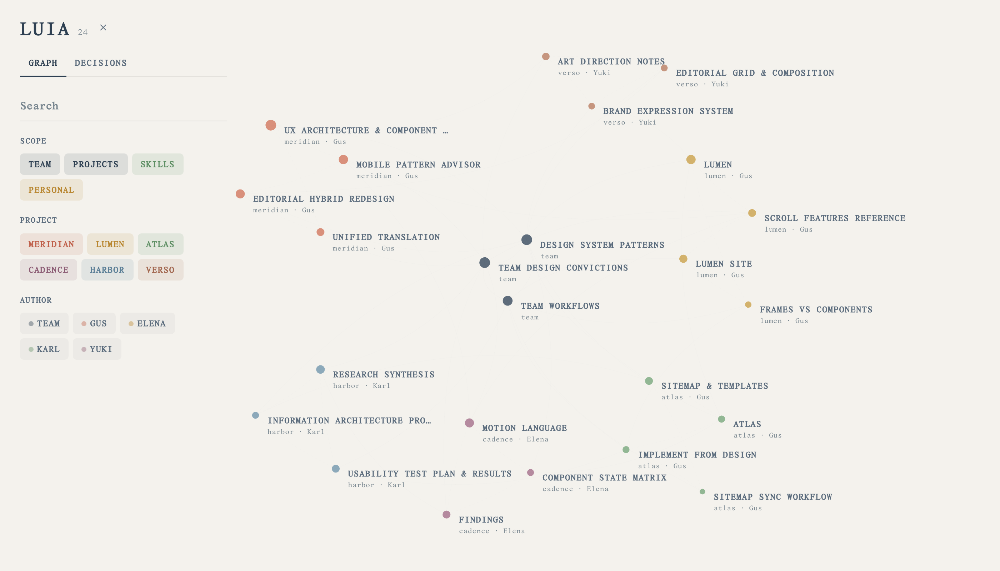

<div align="center">
  
  <h1>Luia</h1>
  <p><strong>A knowledge graph for design teams.</strong></p>
  <p>
    Your team's conventions, decisions, and hard-won patterns —<br>
    mapped as a graph you can actually navigate.
  </p>
</div>

---

Design teams accumulate knowledge faster than they can organise it. A spacing
rule agreed in March, a carousel pattern that tested badly, the reason a
component was built one way and not another. It ends up scattered across docs,
threads, and people's memory, and by the time someone needs it nobody can find
it.

Luia renders that knowledge as a graph. Every document is a node. Every
relationship is an edge — a team principle grounding a project decision, two
pieces of work that belong together, or a method proven on one engagement and
carried into the next. Instead of a folder tree that flattens everything into
one hierarchy, you get the actual shape of what your team knows.

<div align="center">
  
</div>

## Features

- **Spatial navigation** — a 3D force-directed graph you can pan, zoom, and
  explore, with hand-composed positions so the layout reads deliberately
  rather than like a hairball.
- **Four ways to filter** — by scope, project, author, or free-text search
  across titles, tags, descriptions, and section headings.
- **The author lens** — dim everything except one person's contributions to see
  who holds which knowledge, and where a single point of failure is forming.
- **Typed relationships** — `foundation`, `reference`, and `sibling` edges are
  drawn differently, so how two documents relate is legible at a glance.
- **Readable content** — every node carries full Markdown, a description, and a
  section outline; click any node to read it without leaving the graph.

## Getting started

Requires [Node.js](https://nodejs.org) 20.19+ or 22.12+ (Vite 8).

```bash
git clone https://github.com/gustavocambareri/luia.git
cd luia
npm install
npm run dev
```

Open the address Vite prints (usually `http://localhost:5173`) and the demo
graph loads immediately.

```bash
npm run build     # production build to dist/
npm run preview   # serve that build locally
npm run lint      # eslint
```

> [!NOTE]
> The bundled graph is **entirely fictional**. Meridian, Lumen, Atlas, Cadence,
> Harbor, and Verso are invented engagements, and every person credited in them
> is made up. Nothing here is real client work.

## Using it with your team

All content lives in one file: `src/data/graph-data.json`. Replace it with your
own and the app is yours — there is no database, no backend, and no service to
sign up for.

A node looks like this:

```json
{
  "id": "projects/atlas/block-library",
  "name": "Atlas — Block Library",
  "slug": "block-library",
  "scope": "project",
  "project": "atlas",
  "author": "Gus",
  "tags": ["atlas", "blocks", "templates"],
  "created": "Mon Mar 16 2026 01:00:00 GM",
  "fileSize": 8200,
  "description": "Reusable blocks and page templates for the Atlas redesign.",
  "body": "# Atlas — Block Library\n\n## Navigation\n\nSticky header that…",
  "sections": ["Atlas — Block Library", "Navigation"],
  "connections": ["_team/design-system-patterns"]
}
```

And an edge connects two of them:

```json
{
  "source": "_team/design-system-patterns",
  "target": "projects/atlas/block-library",
  "type": "reference",
  "label": "informs",
  "description": "Team patterns applied in the Atlas block library."
}
```

The full shape is defined in [`src/lib/types.ts`](src/lib/types.ts).

### Fields worth understanding

| Field | What it does |
| --- | --- |
| `scope` | `team` for shared knowledge, `project` for engagement work. Drives colour and grouping. |
| `project` | Required when `scope` is `project`. Becomes a filter chip automatically. |
| `author` | Powers the author lens. Use `team` for collectively-owned documents. |
| `fileSize` | Controls node radius. Scale your values into roughly `2600–19500` so sizes stay differentiated. |
| `body` | Markdown, rendered in the detail panel. |
| `sections` | Heading list, included in search. |
| `type` | Edge weight and curvature: `foundation` arcs through the centre, `sibling` hugs the perimeter. |

### Adding a project

1. Add your nodes to `graph-data.json` with a new `project` value.
2. Add a colour for it in [`src/lib/colors.ts`](src/lib/colors.ts) → `PROJECT_COLORS`.
   Without one it falls back to the default ink, and becomes indistinguishable
   from team nodes.
3. Optionally place its nodes in `MANUAL_POSITIONS` in
   [`src/components/graph3d/useForceLayout.ts`](src/components/graph3d/useForceLayout.ts).
   Nodes without coordinates are positioned automatically, but hand-placing
   them keeps clusters legible.

The filter chips read the project list straight from your data, so step 1 is
enough to make it appear in the UI.

> [!TIP]
> Keep `id` values path-like (`projects/<project>/<slug>`). Nothing enforces it,
> but it keeps the file browsable and makes `connections` easy to write by hand.

## Design decisions

A few choices are deliberate and worth knowing before you extend it:

- **Positions are authored, not simulated.** A pure force layout drifts on every
  reload and buries the structure. Coordinates live in `useForceLayout.ts` so
  the composition is stable and intentional.
- **Colour is a system, not decoration.** Every hue in `colors.ts` is derived
  from a five-colour palette and tuned to a narrow contrast band, so no project
  reads as visually heavier than another.
- **Uppercase titles, explicit weights.** Type rules are applied consistently
  across the canvas and panel; if you add UI, set `fontWeight` explicitly rather
  than inheriting it.

## Project structure

```
src/
├── data/graph-data.json      # all content — replace this with yours
├── lib/
│   ├── types.ts              # GraphNode, GraphEdge, GraphData
│   └── colors.ts             # palette, scope/project/author colour maps
├── hooks/useGraphData.ts     # filtering, search, selection state
└── components/
    ├── FilterBar.tsx         # scope/project/author filters, search
    ├── DecisionLog.tsx       # per-node detail panel
    └── graph3d/              # the 3D scene
        ├── useForceLayout.ts # hand-placed node coordinates
        ├── GraphNode3D.tsx   # node + label rendering
        └── GraphEdge3D.tsx   # typed, curved edges
```

## Built with

[React 19](https://react.dev) · [TypeScript](https://www.typescriptlang.org) ·
[Vite](https://vite.dev) · [Three.js](https://threejs.org) via
[React Three Fiber](https://r3f.docs.pmnd.rs) ·
[Tailwind CSS](https://tailwindcss.com)
