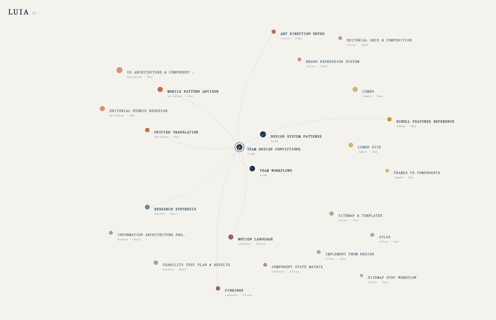

# Luia

**A knowledge graph for design teams.**

Design teams accumulate knowledge faster than they can organise it. A spacing
rule agreed in March, a carousel pattern that tested badly, the reason a
component was built one way and not another. It ends up scattered across docs,
threads, and people's memory, and by the time someone needs it nobody can find
it.

Luia has two halves:

- **An MCP server** that plugs into Claude. Designers and developers install it
  once, and from then on Claude reads the team's conventions before answering
  and writes new decisions back as they are made.
- **A graph viewer** that renders the same knowledge spatially, so you can see
  how decisions connect instead of scrolling a folder tree.

Both read the same plain Markdown folder. There is no database, no backend, and
no service to sign up for — which means a team shares its knowledge by putting
that folder in git.

## Install the MCP server

Requires [Node.js](https://nodejs.org) 20.19+ or 22.12+.

```bash
git clone https://github.com/gustavocambareri/Luia_MCP.git
cd Luia_MCP
npm install
```

Point Claude at it. `LUIA_KNOWLEDGE_DIR` is the folder your team's Markdown
lives in — anywhere you like:

```bash
claude mcp add luia --scope user \
  --env LUIA_KNOWLEDGE_DIR="$HOME/luia-knowledge" \
  -- node "$PWD/server/index.mjs"
```

Verify it connected:

```bash
claude mcp list        # luia: … - ✔ Connected
```

For Claude Desktop, add the same thing to `claude_desktop_config.json`:

```json
{
  "mcpServers": {
    "luia": {
      "command": "node",
      "args": ["/absolute/path/to/luia/server/index.mjs"],
      "env": { "LUIA_KNOWLEDGE_DIR": "/absolute/path/to/your-knowledge" }
    }
  }
}
```

That's the whole setup. Ask Claude *"what's our spacing rule?"* and it searches
the store before answering.

### What Claude can do with it

| Tool | When Claude reaches for it |
| --- | --- |
| `search_knowledge` | Before answering anything about how your team designs or builds — so the answer matches decisions you already made |
| `get_document` | When a search excerpt looks relevant and it needs the full rule |
| `record_decision` | The moment you settle a convention, so it survives the session |
| `list_documents` | To see everything the team has written down |

The two that matter are **search** and **record**. Search is described so Claude
calls it unprompted at the start of design work — nobody remembers to ask for
their own conventions. Record is a single call with no ceremony, because a
capture step with friction is a capture step that doesn't happen.

### Using it with your team

The knowledge store is a folder of Markdown files, so sharing it is just git:

```bash
cd ~/luia-knowledge
git init && git add . && git commit -m "Team knowledge"
git remote add origin git@github.com:your-team/design-knowledge.git
git push -u origin main
```

Teammates clone that repo and point their own `LUIA_KNOWLEDGE_DIR` at it. Pull
to get everyone's decisions; push to share yours. Decisions arrive as readable
diffs you can review like any other change.

Each document is plain Markdown with frontmatter — editable by hand, no tool
required:

```markdown
---
title: Spacing System
project: atlas          # optional; omit for team-wide knowledge
author: your-name       # or 'team' for collectively-owned decisions
tags: [spacing, layout]
created: 2026-03-09
---

8px base unit, with a 4px step for tight UI.

**Why:** the ratio between gaps carries more meaning than absolute values.
```

> [!TIP]
> Always write the **why**. A decision without its rationale is one the team
> relitigates in six weeks — and the rationale is what makes Claude apply the
> rule correctly to a case you didn't anticipate.

## The graph viewer

- **Spatial navigation** — a 3D force-directed graph you can pan, zoom, and
  explore, with hand-composed positions so the layout reads deliberately
  rather than like a hairball.
- **Four ways to filter** — by scope, project, author, or free-text search
  across titles, tags, descriptions, and section headings.
- **The author lens** — dim everything except one person's contributions to see
  who holds which knowledge, and where a single point of failure is forming.
- **Typed relationships** — `foundation`, `reference`, and `sibling` edges are
  drawn differently, so how two documents relate is legible at a glance.
- **Readable content** — every node carries full Markdown, a description, and a
  section outline; click any node to read it without leaving the graph.

### Running the viewer

```bash
npm run dev
```

Open the address Vite prints (usually `http://localhost:5173`) and the demo
graph loads immediately.

```bash
npm run build     # production build to dist/
npm run preview   # serve that build locally
npm run lint      # eslint
```

> [!NOTE]
> The bundled graph is **entirely fictional**. Meridian, Lumen, Atlas, Cadence,
> Harbor, and Verso are invented engagements, and every person credited in them
> is made up. Nothing here is real client work.

### Viewer data format

The viewer reads `src/data/graph-data.json`. Replace it with your own and the
app is yours.

A node looks like this:

```json
{
  "id": "projects/atlas/block-library",
  "name": "Atlas — Block Library",
  "slug": "block-library",
  "scope": "project",
  "project": "atlas",
  "author": "your-name",
  "tags": ["atlas", "blocks", "templates"],
  "created": "Mon Mar 16 2026 01:00:00 GM",
  "fileSize": 8200,
  "description": "Reusable blocks and page templates for the Atlas redesign.",
  "body": "# Atlas — Block Library\n\n## Navigation\n\nSticky header that…",
  "sections": ["Atlas — Block Library", "Navigation"],
  "connections": ["_team/design-system-patterns"]
}
```

And an edge connects two of them:

```json
{
  "source": "_team/design-system-patterns",
  "target": "projects/atlas/block-library",
  "type": "reference",
  "label": "informs",
  "description": "Team patterns applied in the Atlas block library."
}
```

The full shape is defined in [`src/lib/types.ts`](src/lib/types.ts).

### Fields worth understanding

| Field | What it does |
| --- | --- |
| `scope` | `team` for shared knowledge, `project` for engagement work. Drives colour and grouping. |
| `project` | Required when `scope` is `project`. Becomes a filter chip automatically. |
| `author` | Powers the author lens. Use `team` for collectively-owned documents. |
| `fileSize` | Controls node radius. Scale your values into roughly `2600–19500` so sizes stay differentiated. |
| `body` | Markdown, rendered in the detail panel. |
| `sections` | Heading list, included in search. |
| `type` | Edge weight and curvature: `foundation` arcs through the centre, `sibling` hugs the perimeter. |

### Adding a project

1. Add your nodes to `graph-data.json` with a new `project` value.
2. Add a colour for it in [`src/lib/colors.ts`](src/lib/colors.ts) → `PROJECT_COLORS`.
   Without one it falls back to the default ink, and becomes indistinguishable
   from team nodes.
3. Optionally place its nodes in `MANUAL_POSITIONS` in
   [`src/components/graph3d/useForceLayout.ts`](src/components/graph3d/useForceLayout.ts).
   Nodes without coordinates are positioned automatically, but hand-placing
   them keeps clusters legible.

The filter chips read the project list straight from your data, so step 1 is
enough to make it appear in the UI.

> [!TIP]
> Keep `id` values path-like (`projects/<project>/<slug>`). Nothing enforces it,
> but it keeps the file browsable and makes `connections` easy to write by hand.

## Design decisions

A few choices are deliberate and worth knowing before you extend it:

- **Positions are authored, not simulated.** A pure force layout drifts on every
  reload and buries the structure. Coordinates live in `useForceLayout.ts` so
  the composition is stable and intentional.
- **Colour is a system, not decoration.** Every hue in `colors.ts` is derived
  from a five-colour palette and tuned to a narrow contrast band, so no project
  reads as visually heavier than another.
- **Uppercase titles, explicit weights.** Type rules are applied consistently
  across the canvas and panel; if you add UI, set `fontWeight` explicitly rather
  than inheriting it.

## Project structure

```
server/                       # the MCP server
├── index.mjs                 # tool definitions + stdio transport
└── knowledge.mjs             # Markdown store: read, write, search

src/                          # the graph viewer
├── data/graph-data.json      # demo content — replace this with yours
├── lib/
│   ├── types.ts              # GraphNode, GraphEdge, GraphData
│   └── colors.ts             # palette, scope/project/author colour maps
├── hooks/useGraphData.ts     # filtering, search, selection state
└── components/
    ├── FilterBar.tsx         # scope/project/author filters, search
    ├── DecisionLog.tsx       # per-node detail panel
    └── graph3d/              # the 3D scene
        ├── useForceLayout.ts # hand-placed node coordinates
        ├── GraphNode3D.tsx   # node + label rendering
        └── GraphEdge3D.tsx   # typed, curved edges
```

## Built with

[React 19](https://react.dev) · [TypeScript](https://www.typescriptlang.org) ·
[Vite](https://vite.dev) · [Three.js](https://threejs.org) via
[React Three Fiber](https://r3f.docs.pmnd.rs) ·
[Tailwind CSS](https://tailwindcss.com)
